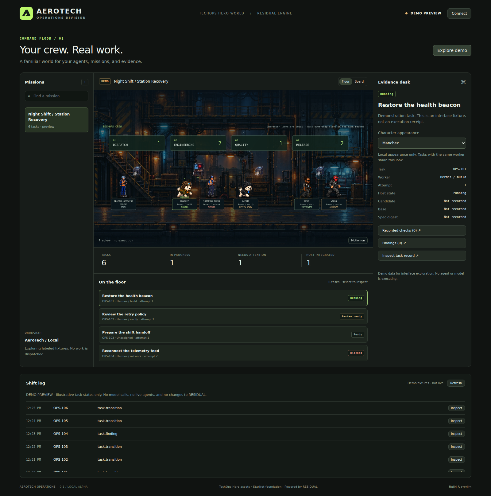

# AeroTech Staff

A local operations floor for RESIDUAL Command Station, styled with TechOps Hero game assets. This repository contains the tested **0.1 source-run alpha** and the master implementation specification for continued development.



## Start

Requires Node.js 20 or later. No dependency installation is needed.

```sh
git clone https://github.com/ninja-ops-guy/AeroTech-Staff.git
cd AeroTech-Staff
npm start
```

Open the URL printed in the terminal, then select **Explore demo**. The server chooses a free loopback port automatically, so it can coexist with your existing service.

Connect to your running RESIDUAL Command Station using its actual address:

```sh
npm start -- --station http://127.0.0.1:8765
```

The connection is read-only by default. Enable confirmed run, triage, pause and resume requests explicitly:

```sh
npm start -- --station http://127.0.0.1:8765 --control
```

Run requests can use the station's configured model providers and execute its permitted tests and integration policy. Provider credentials remain with RESIDUAL. For a fixed AeroTech port add `--port 8899`; use `--port 0` for automatic allocation. No existing process is stopped.

On Windows, you can also double-click `aerotech/start-aerotech.cmd` and keep its terminal open.

## TechOps crew

The floor now includes Mike, Waldo, Katrin, Manchez, the plating operator and the shipping clerk. Select a task and use **Character appearance** to choose a local look; tasks assigned to the same worker share that choice. Choices persist in this browser.

Four characters use the game’s authored idle and locomotion frames. The operator and clerk use their static game portraits. Room transitions use elapsed-time movement with foot anchors; stale or paused missions freeze, and **Motion off** gives an unanimated view. These are cosmetic task representations, not additional agents.

The update passes 16 focused tests and desktop/mobile browser checks. See [`crew-verification.json`](aerotech/qa/crew-verification.json) for the checks and limits.

## Contents

- [`aerotech/`](aerotech/): standalone app, local adapter, durable command journal and game artwork.
- [`aerotech/README.md`](aerotech/README.md): detailed behavior, contract boundaries and source attribution. Its final fork-continuation paragraph describes the original development checkout; this repository uses the root commands above.
- [`docs/IMPLEMENTATION-STATUS.md`](docs/IMPLEMENTATION-STATUS.md): current scope and continuation guidance.
- [`docs/RESIDUAL_Factory_Studio_Master_Spec_R0.md`](docs/RESIDUAL_Factory_Studio_Master_Spec_R0.md): original master spec, parallel Hermes work assignments and qualification gates. It is a proposal, not a record of completed gates; read the status addendum first.
- [`aerotech/qa/verification.json`](aerotech/qa/verification.json): recorded desktop/mobile and real RESIDUAL training-mission verification, with explicit limitations.

## Tests

```sh
npm test
```

The focused suite covers adapter contracts, local-session protection, port coexistence, stale revisions, durable deduplication and ambiguous-command fencing. The initial build also passed browser verification against the pinned RESIDUAL source with scripted training proposals and real local Git/check execution. No live model calls, Windows installer or full Hermes qualification are claimed.

The broader verification harness is `aerotech/qa/verify.cjs`; provide a RESIDUAL source checkout as its argument and make Playwright plus a Chromium executable available through `TEST_PLAYWRIGHT_MODULE` and `TEST_CHROMIUM_PATH` as needed. It creates temporary training data.

## Provenance

Imported from development commit `6f94d9cb181f31ec0e28dfe4263c5dfb43f34773`, based on StarNet `fbddbf992f8e7082196f07c3024781fcf1c276fc`. The initial import preserved the standalone application byte-for-byte. Subsequent crew changes are recorded in Git; the original source manifest is retained in `aerotech/qa/initial-build-manifest.json`, and its original verification remains historical evidence. This repository does not contain the full StarNet desktop source or history.

StarNet's vendored document model retains its [MIT notice](aerotech/STARNET-LICENSE.txt). TechOps Hero artwork was reused at the owner's request; the [asset manifest](aerotech/ASSET-MANIFEST.json) records exact sources and hashes. Those game assets are not covered by StarNet's MIT notice. No broader license grant is asserted here.
