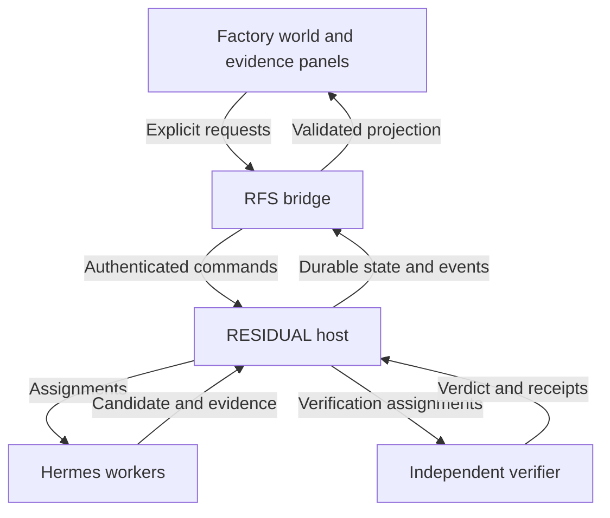

# RESIDUAL Factory Studio master implementation specification

Specification ID: RFS-MASTER-001  
Revision: R0  
Prepared: 2026-09-30 UTC / 2026-09-29 America/New_York  
Working product name: RESIDUAL Factory Studio  
Audience: Mike Olivares and parallel Hermes implementation agents  
Status: Implementation proposal and dispatch package; no implementation or qualification is claimed

## 1 Purpose and decision

Build a separately branded derivative of StarNet that presents RESIDUAL missions as a living industrial work floor. Use the existing rendering and desktop foundations where practical. RESIDUAL remains authoritative for missions, assignments, permissions, execution, evidence, recovery, and acceptance. The interface makes those facts visible and exposes explicitly supported control requests.

The first useful result is a local, read-only floor showing one real mission, a worker, an independent verifier, its artifacts, and an acceptance decision. The next result is a bounded control surface. Original industrial graphics and a separately identified desktop package complete the alpha.

This program is separate from RESIDUAL v1 closure. It must not alter an accepted release candidate, repurpose production seats, or introduce a new v1 release gate. A missing RESIDUAL capability becomes a tracked prerequisite or a separately scoped change. It never becomes an invented success event.

The name is provisional. The product must clearly identify its derivation in credits without using StarNet branding or excluded artwork as its own.

## 2 Evidence boundary and source register

This specification uses the public StarNet repository documentation inspected on September 30 UTC and the RESIDUAL goals discussed with the owner. It is not a source-code audit of either project. No current RESIDUAL commit, API, release status, or installed StarNet version has been verified for this document. Agents must resolve these in Gate G0 before implementation depends on them.

| Source | Observed information | Use and limitation |
| --- | --- | --- |
| S1 https://github.com/androoAGI/starnet | README describes separate frontend, Node sidecar, shared contracts, and Tauri shell; runtime events reach the frontend through HTTP/NDJSON and SSE | Architectural starting point; pin an exact revision before relying on it |
| S2 https://github.com/androoAGI/starnet/blob/feat/harness-backend/CODE_MAP.md | Code map identifies `sidecar/index.js` as a conflict hotspot, frontend roster ownership, `PORT`/`SKYNET_PORT` overrides, and desktop packaging | Historical documentation with possible drift; verify code and installed-build behavior |
| S3 https://github.com/androoAGI/starnet/blob/feat/harness-backend/NOTICE.md | Notices distinguish reusable code from excluded branding/art; list third-party notices including a transitive LGPL component | Inspect exact distributed dependencies and asset provenance; do not assume one license covers every file |
| S4 https://starnetos.com/#station | Public product concept and live-state presentation | Design context only; marketing descriptions are not conformance evidence |

All new identifiers, JSON fields, endpoint paths, module names, timings, colors, and workflows below are proposed RFS contracts. They are not claims about existing RESIDUAL interfaces. Prefer mappings onto verified native contracts over introducing duplicate semantics.

## 3 Outcomes and boundaries

### Required alpha outcomes

1. Start alongside another service using StarNet's usual port without terminating, impersonating, or modifying that service.
2. Maintain separate application identity, data directory, credentials namespace, single-instance lock, and update configuration.
3. Show live RESIDUAL state with source identity, freshness, and traceable evidence.
4. Recover the same accepted mission state after refresh, disconnect, or application restart.
5. Distinguish worker submission, verification, approval, and host acceptance.
6. Run supported commands through an authenticated, capability-negotiated bridge.
7. Replace excluded upstream brand assets with original assets and preserve required attribution.
8. Complete one bounded dogfooding mission with a real output and independently checked acceptance evidence.
9. Ship a source-run alpha and, after desktop qualification, a Windows package under an independent identity.

### Deferred until a later program

Public hosting, multi-tenant accounts, billing, remote LAN access, mobile control, 3D rendering, autonomous self-updating, broad marketplace integration, production deployment automation, and a general workflow editor are out of alpha scope. macOS packaging follows demonstrated Windows/source behavior. Do not retain an upstream feature in the new UI merely because it exists: unsupported providers, schedules, autonomy, or capability controls must be hidden or clearly disabled.

Visual layout is presentation-only for alpha. Moving a desk, drawing a conveyor, or placing a tool object cannot change execution permissions or scheduling. A future layout-to-policy compiler requires its own authenticated proposal, validation, and host decision.

## 4 Authority and invariants

| ID | Requirement |
| --- | --- |
| INV-01 | Only the verified RESIDUAL authority for a mission can establish authoritative mission transitions. |
| INV-02 | Worker completion is a submission claim. It cannot be rendered as verification or acceptance. |
| INV-03 | Verification and acceptance bind to exact candidate identity and acceptance-criteria revision. |
| INV-04 | A changed candidate cannot inherit the previous candidate's qualification or approval. |
| INV-05 | Disconnection means freshness is unknown. Preserve last known facts with a stale indicator. |
| INV-06 | An animation, local timer, chat message, or optimistic UI update cannot grant authority or establish completion. |
| INV-07 | Replayed or duplicate events cannot duplicate command side effects or acceptance. |
| INV-08 | Agent identity, execution attempt, session, and generation are separate fields. A reused display name proves none of them. |
| INV-09 | Credentials and bearer tokens remain outside the rendered world, transcripts, URLs, receipts, and exported diagnostics. |
| INV-10 | Transport byte equality is distinct from sender authentication, artifact safety, correctness, and execution permission. |
| INV-11 | A renderer crash or unavailable visualization must not alter host execution state. |
| INV-12 | Simulation fixtures and replay views remain visibly separated from live state and cannot issue live commands. |
| INV-13 | The fork cannot dispatch a RESIDUAL mission through the upstream model loop as a hidden fallback. |
| INV-14 | Approval is scoped to a named action and exact subject; merge, deploy, and publish are separate actions. |
| INV-15 | Restart cannot silently reissue an action with unresolved outcome. Reconcile its durable command identity first. |

## 5 Architecture and responsibility



The bridge belongs to the fork unless G0 proves a small separate process is safer. It adapts RESIDUAL interfaces into a versioned presentation contract. It authenticates to the host, normalizes supported events, tracks replay positions, and exposes a local UI boundary. It cannot manufacture a missing host decision.

The frontend projection is a deterministic reducer over validated snapshots and events. Canvas animation and accessibility views consume that projection. Neither the renderer nor localStorage becomes the authoritative roster or mission store.

The upstream runtime must be disabled for RESIDUAL-managed missions. Prefer an explicit `residual` backend mode with a small compatibility seam. Do not execute two schedulers, two budget ledgers, or two recovery policies for one mission. Any retained native mode uses a separate workspace, prominent mode label, and separate mission namespace; native mode is not required for alpha.

| Layer | Owns | Must not own |
| --- | --- | --- |
| RESIDUAL host | Assignment, policy, budgets, execution decisions, acceptance and durable mission records | Animation coordinates |
| RFS bridge | Authentication boundary, contract mapping, reconnect, command correlation | New authority inferred from prose |
| Projection reducer | Derived display state, provenance links, freshness | Independent mission mutations |
| World renderer | Positions, visual transitions, selection | Completion, permissions, provider routing |
| Desktop launcher | Own process, private launch handoff, application namespace | Killing foreign processes or selecting a host by port alone |
| Evidence inspector | Safe inspection of referenced artifacts and decisions | Executing artifact contents |

## 6 G0 reconnaissance and baseline freeze

The coordinator starts with a read-only inventory. The other agents can inspect their areas and propose contracts concurrently, but shared implementation begins only after the baseline and ownership map are frozen.

Record these fields in `program/rfs/BASELINE.json`:

```json
{
  "spec_id": "RFS-MASTER-001",
  "spec_revision": "R0",
  "upstream": {"origin": "UNRESOLVED", "commit": "UNRESOLVED", "tree": "UNRESOLVED"},
  "fork": {"origin": "UNRESOLVED", "base_commit": "UNRESOLVED", "tree": "UNRESOLVED"},
  "residual": {"origin": "UNRESOLVED", "commit": "UNRESOLVED", "tree": "UNRESOLVED"},
  "contract_revision": "UNRESOLVED",
  "runtime_versions": {},
  "capabilities": {},
  "installed_app_version": "UNRESOLVED",
  "file_ownership_revision": "UNRESOLVED"
}
```

`UNRESOLVED` is a planning sentinel, never admissible as a qualification identity. Git object IDs must use the repository's declared object format. Receipt artifact digests use SHA-256. Record full IDs, clean/dirty status, operating system, runtime versions, and lockfile digest. Review applicable repository instructions before editing.

Required reconnaissance outputs:

- Actual startup path for source and packaged application; all port, URL, instance-lock, and data-root configuration points.
- Actual event definitions, event emission and consumption sites, roster writers, and local persistence writers.
- Actual RESIDUAL read and command surfaces with code references and authentication requirements.
- Capability matrix: `available_verified`, `available_unqualified`, `missing`, or `unknown` for each required operation.
- Asset and dependency inventory including images, inline sprite data, icons, fonts, audio, logos, and compiled resources.
- Baseline test results with existing failures separated from new regressions.
- Selected build scripts from the pinned package manifests; do not trust historical command descriptions blindly.

G0 passes when baseline identities are concrete, each shared file has one owner, the minimum read path is identified, and missing capabilities have explicit dispositions. If there is no live read path, fixture and UI work may continue, but live integration remains blocked.

## 7 Port coexistence and desktop identity

### Proposed startup behavior

New fork configuration names are `RFS_PORT`, `RFS_DATA_DIR`, and `RFS_RESIDUAL_URL`; these must be implemented and documented before advertised as supported. Configuration precedence is explicit launch argument, environment, saved nonsecret setting, then default. Credentials are supplied separately through the approved credential mechanism.

For packaged desktop launch, default to an operating-system-assigned loopback port. The sidecar binds port zero and reports the assigned address to the parent through an inherited pipe or another private handoff. Do not find a free port, close it, and later attempt to reuse it. The desktop UI must receive the actual bound URL.

For source-run development, allow a chosen port. If an explicitly requested port is occupied, stop with `PORT_IN_USE`, identify the requested address, and provide a documented way to select another port. Do not silently move an explicitly pinned endpoint. For automatic desktop mode, bind an available port atomically.

Binding defaults to loopback. Ensure IPv4/IPv6 resolution cannot accidentally widen exposure. A successful TCP connection is insufficient to identify a service. Verify protocol, product identity, backend identity, and a launch-instance proof before treating an endpoint as the fork's sidecar. Reject a foreign service even if it exposes a similarly named health endpoint.

The endpoint handoff must resist a stale discovery file and another process impersonating the last instance. Restrict file permissions if a file is used. Do not put authentication tokens in URLs or browser history. Shutdown terminates only the child process whose creation and instance identity the launcher owns.

### Namespace inventory

Use distinct bundle/application identifier, display name, user-data root, keychain service, cache root, log root, single-instance mutex, protocol handlers, shortcuts, installer metadata, and update configuration. G0 determines actual locations. Do not derive or overwrite an existing StarNet workspace by default.

Disable inherited auto-update destinations and release publishing credentials in the fork. Fork workflows must not publish to upstream release targets. An independent updater is deferred unless separately qualified; a source alpha may ship with updating disabled and documented.

### Required port tests

1. A benign test server holds the upstream default port; fork launch succeeds in automatic mode and the existing server remains responsive.
2. An explicit occupied port produces a clear error and no foreign-process termination.
3. UI and sidecar use the same selected address after refresh and restart.
4. A spoof server and stale discovery record fail service-identity verification.
5. Two instances either isolate cleanly or activate the correct existing instance, according to a documented policy.
6. Shutdown releases only owned resources; application data remains intact.
7. The packaged build repeats the relevant tests; source-run success alone does not qualify packaging.

## 8 Contract freeze C0

C0 freezes a proposed presentation contract, schemas, fixture traces, capability negotiation, and error vocabulary. The host's existing model is controlling when verified. The adapter maps it explicitly; it does not rename a host claim into a stronger claim.

### Core entities

| Entity | Required semantic fields |
| --- | --- |
| Backend identity | Backend ID, implementation/version, protocol revision, authority epoch, capabilities |
| Mission | Mission ID, title, criteria revision/digest, scope, policy reference, current phase, candidate references |
| Assignment | Assignment ID, mission/task ID, role, worker identity, scope, lease/generation when supported |
| Attempt | Attempt ID, assignment ID, session identity, generation, provider/model reference, lifecycle, first failure |
| Candidate | Candidate ID, revision, source identity or artifact manifest digest, criteria digest |
| Artifact | Artifact ID/version, media type, byte length, digest algorithm/digest, authorized location reference |
| Verification | Receipt ID, verifier identity, candidate identity, criteria digest, checks, verdict, provenance |
| Approval | Decision ID, authenticated actor, action, exact subject identity, policy context, result |
| Acceptance | Host decision ID, exact candidate and criteria, required receipt references, authority identity |
| Checkpoint | Checkpoint ID, attempt/candidate binding, digest, format, compatibility and admission result |
| Command | Command ID, idempotency key, authenticated actor, expected revision, action and outcome |

Unavailable source fields are explicitly absent with an unsupported reason. Do not synthesize trusted identity from display names. If a missing field is required for a control action or acceptance display, disable that operation or display `UNVERIFIED` with the missing evidence.

### Event envelope

The following is illustrative JSON, not a captured event. C0 publishes a JSON Schema and positive/negative fixtures for the finalized version.

```json
{
  "schema_version": "rfs.event.v1",
  "event_id": "example-event-42",
  "backend_id": "example-backend",
  "authority_epoch": "example-epoch",
  "stream_id": "example-mission-stream",
  "sequence": 42,
  "occurred_at": "2026-09-30T03:30:00Z",
  "type": "candidate.submitted",
  "mission_id": "example-mission",
  "subject_revision": 7,
  "correlation_id": "example-command",
  "causation_id": "example-event-41",
  "producer": {"kind": "host", "id": "example-host"},
  "source_ref": {"record_id": "example-native-record"},
  "payload": {"candidate_id": "example-candidate"}
}
```

Sequence numbers are contiguous within a declared stream and epoch. They do not establish cross-stream ordering. If the native source lacks this guarantee, the bridge must use an explicitly adapter-owned durable stream or a snapshot-only profile; it cannot pretend native ordering exists. Authentication establishes whether the producer may emit the event class. A `producer.kind` string is not authentication.

Accepted source events are append-only inputs. Corrections and supersession are new events. Timestamps are for display and latency estimates, never primary ordering. The bridge annotates local receipt time separately. Unknown additive fields may be retained without execution; unknown authority-affecting event types stop the affected projection and trigger reconciliation. Ordinary unknown informational events can appear as unsupported entries.

### Minimum event vocabulary

`mission.created`, `assignment.created`, `attempt.started`, `attempt.progress`, `attempt.submitted`, `attempt.failed`, `attempt.cancelled`, `candidate.submitted`, `artifact.received`, `artifact.transport_verified`, `verification.started`, `verification.completed`, `approval.requested`, `approval.decided`, `acceptance.decided`, `checkpoint.recorded`, and `recovery.decided` are proposed logical events. Map to verified native equivalents; unsupported events stay unavailable.

The UI also has local connection states `CONNECTING`, `LIVE`, `STALE`, `RESYNCING`, `OFFLINE`, and `INCOMPATIBLE`. These never change host mission outcomes.

### Snapshot and replay

A snapshot contains backend identity, epoch, schema revision, mission entities, per-stream high-water cursors, and provenance references. It represents a consistent cut. Subscribe from its cursor, or buffer events before taking a snapshot and discard entries already represented by the returned cut. Do not leave a gap between snapshot and subscription.

Deduplicate by backend/epoch/stream/event ID and enforce sequence checks. The same ID with different bytes is a conflict, not a duplicate. On gaps or epoch change, stop applying the affected stream, mark stale, and reconcile. C0 sets a bounded buffer and overflow policy. Proposed alpha limit: 5,000 events or 10 MiB per connection, whichever occurs first, followed by snapshot resynchronization. Never silently discard acceptance-related events.

Persist only the projection cache and cursor needed for quick startup. Display it as stale until backend identity and state are reconciled. Restarted or expired cursors require a new snapshot. If only snapshot polling is supported, label the mode and refresh interval accurately; do not claim event replay qualification.

### Capability handshake

Negotiate read snapshots, event resume, candidate identity, verification receipts, acceptance records, command support, idempotency, cancellation, approval, checkpoint recovery, and budget visibility independently. An older or partial backend can still support read-only views. Never enable a control merely because an HTTP route exists.

## 9 Mission lifecycle and display semantics

The presentation phase follows host facts, not an independent workflow engine. The usual path is `QUEUED → RUNNING → SUBMITTED → VERIFYING → AWAITING_APPROVAL → ACCEPTED`. Approval may be skipped only when host policy explicitly permits it. Failure, cancellation, rejection, and recovery attach to the relevant entity and attempt.

Keep attempt state separate from mission state. An attempt can fail while its mission remains recoverable. Connection state is orthogonal to both. Acceptance applies to a named candidate; later candidates do not erase the historical accepted candidate or inherit its status.

| Evidence | Allowed display | Forbidden inference |
| --- | --- | --- |
| Worker says done | Submitted, awaiting verification | Accepted |
| Tool process exits zero | Tool step passed | Mission criteria satisfied |
| All specified verification checks pass | Verified candidate | Owner approval granted |
| Owner approves a candidate | Approved for the named action | Merge or deployment performed |
| Host acceptance record is admissible | Accepted candidate, decision link | Later modified bytes accepted |
| Stream is disconnected | Last known phase plus stale timestamp | Agent stopped or failed |
| Provider changed | Recorded recovery/provider transition | Checkpoint resumed successfully |
| Artifact digests match | Transport verified | Sender trusted or content safe |

If receipts are unavailable, show the observed host claim with an unverified label and a reason; do not fabricate receipt links. Where the host contract requires receipts for acceptance, the acceptance badge remains unavailable until those conditions are met.

## 10 Commands and permission boundary

Read-only mode is the default alpha startup. Control mode requires an authenticated capability handshake and successful command-boundary qualification. The UI can request supported `mission.submit`, `mission.cancel`, and `approval.decide` actions. Retry/resume stays disabled until the host recovery contract is mapped and tested. Merge, deploy, and publish are outside alpha commands.

Each request carries protocol version, command ID, idempotency key, backend identity, expected subject revision, action, and a schema-validated payload. The authenticated server context determines actor identity; never trust an actor ID supplied by the frontend. Approval additionally binds the candidate identity, criteria digest, and proposed action.

The response distinguishes `ACKNOWLEDGED`, `REJECTED`, and `OUTCOME_UNKNOWN`. Acknowledgment is not execution success. A later event or authoritative query resolves the outcome. Repeated identical commands return the stored outcome; reuse of an idempotency key with different content is rejected. Revision conflicts require refresh and a new user decision. Idempotency lifetime and scope are documented and persist across bridge restarts for mutating actions.

After a timeout, query by command ID. Do not blindly resend. If the backend lacks idempotency or outcome lookup, do not expose retryable mutating controls until a qualified solution exists. Network delivery is not assumed to be exactly once.

All controls enforce authentication, authorization, origin rules, input bounds, and capability checks at the bridge/host boundary. Loopback does not make an endpoint trusted. Validate host/origin to prevent hostile websites from issuing local commands. If browser SSE is used, choose a credential approach that avoids query-string tokens and validates origin. Treat artifact text, tool outputs, and agent chat as untrusted data; none may instruct the bridge to change policy.

Safe errors include `UNSUPPORTED_CAPABILITY`, `UNAUTHORIZED`, `REVISION_CONFLICT`, `CANDIDATE_MISMATCH`, `STALE_SESSION`, `PROTOCOL_INCOMPATIBLE`, `PORT_IN_USE`, and `OUTCOME_UNKNOWN`. Messages must explain the next step without exposing secrets.

## 11 Transport and evidence admission

Integrate the owner's BL-016 transport requirement as a distinct admission proof when available. Sender commitments bind artifact ID/version, transfer ID, byte length, and digest. The receiver computes the digest over decoded artifact bytes. Only exact agreement can yield `BYTE_EXACT_VERIFIED`. Missing data, decode failure, excess size, or digest mismatch blocks admission and produces a reason.

The bridge displays that receipt and preserves its binding. It does not claim to implement the entire Shared Comms protocol. G0 must identify the controlling BL-016 and SC-MESH contracts in the target repository; any conflict is resolved by explicit mapping or amendment.

Artifact inspection uses authorized artifact identifiers and bounded retrieval. Reject traversal, unauthorized paths, arbitrary URL fetching, and unsafe executable previews. Apply decoded-size limits and bounded decompression if compressed transport is accepted. Default previews render text as text, not trusted HTML. File opening is a separate user action.

Evidence panels show source/backend identity, candidate, criteria, verifier, verdict, receipt digest, and links to available records. A diagnostic export includes selected nonsecret evidence and a redaction manifest. Never export provider credentials, entire user configuration directories, or unrelated mission data.

## 12 Recovery and truthful failure behavior

The interface observes host recovery policy. It never chooses a substitute provider or agent because an animation timed out. FreeLLMAPI fallback, when supported, must follow the user's explicit setting and host failure classification; disabled means no fallback. Record first failure, policy decision, selected provider/model, checkpoint admission, new attempt, and eventual result separately.

Do not enable local models automatically on these seats. A host that supports model admission exposes resource fit and readiness; a host that does not must not be presented as having passed a resource preflight. Existing production agent profiles and credentials are not copied into the fork without a deliberate import workflow.

| Fault | Required behavior |
| --- | --- |
| UI process dies | Host work continues according to host policy; reopened UI reconciles |
| Bridge restarts | Reauthenticate; reconstruct cursor/projection; reconcile pending commands |
| Host restarts | Verify authority identity/epoch; rebuild from current durable records |
| Worker dies | Display host-observed state and recovery decision; preserve prior attempt |
| Provider request fails | Display classified failure and actual recovery policy outcome |
| Verifier disappears | Remain unverified; no acceptance shortcut |
| Approval becomes stale | Disable action and require current candidate review |
| Event stream gaps | Mark affected projection stale; bounded reconciliation |
| Artifact digest differs | Quarantine display and block admission |
| Cancellation races with completion | Show the host's resolved outcome; never infer from click order |

## 13 Industrial visual design

Working art direction: a compact manufacturing command floor with readable machinery, purposeful motion, dark neutral surfaces, warm work lights, and an emerald accent. This is an original environment, not a recolor of excluded StarNet sprites. TechOps Hero can inform tone, but no dependency or asset import is assumed.

| Floor area | Meaning | Inspection content |
| --- | --- | --- |
| Dispatch desk | Mission intake and scope | Criteria, policy, budget, queue |
| Engineering cell | Worker attempt | Identity, assignment, candidate, progress |
| Transfer lane | Artifact handoff | Sender commitment, recipient receipt |
| Quality bay | Independent verification | Checks, verifier, exact candidate |
| Approval desk | Human decision pending | Action, diff/artifact, bound decision |
| Release dock | Accepted candidate | Host acceptance and evidence chain |
| Repair area | Failed/recovering attempt | First failure, checkpoint, recovery |
| Archive | Historical work | Candidate lineage and decision history |

Build the world as one view of the same data as a conventional mission list and evidence inspector. Default desktop layout: mission list on the left, floor in the center, contextual inspector on the right, connection/mode indicator always visible. On narrow windows, switch to list and inspector tabs. Keyboard and screen-reader users must be able to inspect and operate the full supported workflow without navigating a canvas.

Proposed tokens: background `#111820`, panel `#1C2732`, foreground `#E8EEF3`, accent `#2FD6A0`, pending `#F2B84B`, failure `#EF6B73`, disconnected `#9AA8B5`. Validate contrast before acceptance. Color is always paired with a label or icon. Emerald also being a brand accent must not make idle elements look accepted.

Pixel art may use a 32-pixel tile unit, with crisp integer scaling for the world and ordinary readable typography for controls. Freeze tile anchors, atlas metadata, and animation states before mass asset production. Start with original geometric placeholders. Decorative movement must be distinguishable from execution activity; idle breathing cannot imply a live model call.

Minimum alpha art set: floor/wall/door tiles, seven work-area props, a transfer object, worker/verifier/operator character bases, status badges, app icon, and original logo. Faces or uniforms cannot be the only way to distinguish worker roles. Maintain an asset manifest with creator/source, license or rights basis, generation/edit history if relevant, file digest, and reviewed usage scope.

All evidence views show `LIVE`, `REPLAY`, or `DEMO` prominently. Replay adds playback position and source recording identity. Animations can summarize event bursts but cannot suppress failure/approval/acceptance history. Reduced-motion mode disables travel effects while preserving state changes.

Proposed performance acceptance on a recorded reference machine: p95 event-to-display delay below one second at 10 events/second, usable list/inspector for 100 mission records, and a responsive floor with 20 visible workers. A 10,000-event replay must reconcile to the expected state without unbounded growth. Measure these; do not report them as achieved before evidence exists.

## 14 Parallel Hermes program

Recommended staffing is six Hermes sessions: one coordinator/integrator and five specialist lanes. They are implementation agents building this product, not automatically the runtime workers shown inside it. Runtime onboarding is a separate acceptance exercise.

If only four sessions are available, combine C with D and let E run independent verification after A and B stop changing their candidates. Preserve independent final review: authors cannot issue the sole qualification verdict for their own work.

| Seat | Role | Primary ownership | First output |
| --- | --- | --- | --- |
| H0 | Coordinator and integrator | Baseline, contract freeze, shared wiring, integration branch | G0 record, ownership map, ordered board |
| H1 | Lane A runtime and desktop | Launcher, port selection, identity, namespace, package configuration | Port/identity audit and coexistence fix |
| H2 | Lane B RESIDUAL bridge | Adapter, host mapping, schemas, read path, commands | Capability map and C0 proposal |
| H3 | Lane C projection and UI | Reducer, world binding, evidence inspector, controls | Fixture-driven truthful mission view |
| H4 | Lane D art and brand | Original assets, tokens, theme, asset manifest | Art direction sheet and placeholder atlas |
| H5 | Lane E independent verification | Contract tests, fault tests, provenance audit, acceptance receipts | Adversarial test plan and baseline findings |

### Worktree and ownership rules

Each session uses its own Git worktree, branch, runtime workspace, port allocation, and scratch logs. All begin from the same frozen program base. Suggested branch names are `rfs/lane-a-runtime`, `rfs/lane-b-bridge`, `rfs/lane-c-ui`, `rfs/lane-d-art`, and `rfs/lane-e-qualification`. H0 owns `rfs/integration`.

Paths below are proposed new boundaries, not verified upstream paths. H0 publishes exact globs after G0:

| Owner | Proposed owned paths | Shared-file treatment |
| --- | --- | --- |
| H0 | `program/rfs/`, integration wiring | Owns central server entry, frontend boot entry, root manifests/lockfiles and workflow wiring unless explicitly delegated |
| H1 | `sidecar/rfs-launch/`, desktop configuration delegated by H0 | Supplies narrow central-entry changes as patch proposals |
| H2 | `sidecar/rfs/`, `shared/rfs/` | Sole schema author; C0 changes require review |
| H3 | `frontend/app/rfs/`, `frontend/styles/rfs/` | Does not rewrite shared world entry or central app state without ownership transfer |
| H4 | `frontend/assets/rfs/`, theme manifest | No runtime or schema edits |
| H5 | `test/rfs/`, `qa/rfs/` | No production fixes during independent qualification |

Only H0 integrates shared-file patches. File ownership is an explicit lease recorded on the board. Agents never reset another worktree, edit a shared live checkout, force-push another lane, or resolve conflicts by discarding unknown changes. Root dependency changes are proposed to H0; do not create five competing lockfiles.

Agents may push their own branches or open draft PRs only where repository access and owner authorization permit. This document does not grant merge, release, publication, credential access, or production mutation authority. It specifies implementation work; the coordinator records the actual authorization scope supplied when execution starts.

### Wave schedule

| Wave | H0 | A | B | C | D | E |
| --- | --- | --- | --- | --- | --- | --- |
| W0 | Pin sources and allocate ownership | Startup audit | Native contract audit | State-writer audit | Asset audit and original concepts | Baseline tests and failure plan |
| W1 after G0 | Freeze C0 and integrate seams | Port and namespace implementation | Schemas, fixtures, read bridge | Reducer and inspector on C0 fixtures | Placeholder atlas and theme | Contract and isolation tests |
| W2 after C0 | Assemble read-only candidate | Package launch integration | Live read/reconnect | Live projection and stale handling | Replace excluded visuals | Read-only qualification |
| W3 after G2 | Assemble control candidate | Diagnostics and shutdown | Command/idempotency boundary | Supported controls and decision UX | Accessibility and visual polish | Fault/security tests |
| W4 after G3 | Freeze alpha candidate | Packaged-build checks | Resolve owned defects only | Resolve owned defects only | Asset completeness | Independent full journey |

C and D may progress on fixtures while the live bridge is blocked. They may not describe fixture success as live integration. Art production waits for the atlas contract, not for every host capability.

## 15 Work packages and acceptance

| ID | Owner | Work package | Depends on | Acceptance evidence |
| --- | --- | --- | --- | --- |
| RFS-001 | H0 | Pin upstream/fork/RESIDUAL and map instructions | None | Concrete BASELINE and baseline tests |
| RFS-002 | A | Audit startup, ports, identity and workspace roots | 001 | Code references and reproduced collision |
| RFS-003 | A | Implement isolated launch and port handoff | 002, C0 startup contract | Occupied-port, spoof, restart, shutdown tests |
| RFS-004 | B | Map native authority and capabilities | 001 | Operation-by-operation code/evidence map |
| RFS-005 | B/H0 | Freeze C0 schemas and fixtures | 004, C audit | Reviewed schema revision and digest |
| RFS-006 | B | Read bridge and snapshot/replay | 005 | Golden traces, gap/duplicate/restart tests |
| RFS-007 | C | Pure reducer and mode/freshness state | 005 | Deterministic expected states |
| RFS-008 | C | Floor binding and accessible inspector | 007 | One mission inspectable in world and list |
| RFS-009 | D | Original theme and asset inventory | 001, atlas contract | Original assets and provenance manifest |
| RFS-010 | B | Authenticated command boundary | G2, command capability proof | Replay/idempotency/revision tests |
| RFS-011 | C | Submit/cancel/approval controls | 010 | Acknowledgment and uncertain-outcome UX |
| RFS-012 | B/C | Evidence and transport receipt inspection | 006, native receipt map | Exact-candidate and mismatch cases |
| RFS-013 | E | Fault and authority qualification | 003, 006, 008, 010 | Required scenario matrix receipts |
| RFS-014 | A/D | Independent desktop identity and assets | 003, 009 | Installed package coexistence and asset scan |
| RFS-015 | H0/E | Bounded dogfooding mission | G3, 012 | Real output, independent verdict, host acceptance |
| RFS-016 | H0 | Alpha handoff and maintenance guide | G4 | Runbook, compatibility matrix, limitations |

H0 records missing host capabilities as `RFS-DEP-*` items with an owner, evidence, impact, and next action. Keep them out of a frozen RESIDUAL candidate. If implementation requires a RESIDUAL change, use a separate branch and candidate with its own review/qualification.

## 16 Gates

| Gate | Exit condition | What it unlocks |
| --- | --- | --- |
| G0 baseline | Source identities, ownership, startup/authority/asset audits and blockers recorded | Safe parallel implementation |
| C0 contract freeze | Schema, fixtures, reducer semantics, command boundaries and mapping reviewed | Independent producer/consumer development |
| G1 coexistence | Port isolation, process ownership and separate namespace proven | Local fork startup |
| G2 read-only truth | Real mission displayed; duplicate/gap/restart behavior qualified; acceptance never invented | Control implementation and live observer dogfooding |
| G3 controlled operation | Auth, idempotency, cancellation and exact-subject approval pass for supported commands | Bounded control dogfooding |
| G4 alpha qualification | Original assets, real mission, fault tests, evidence and source-run delivery pass | Source alpha handoff |
| G5 desktop qualification | Installed Windows build repeats startup, identity, live read and control journey | Windows package claim |

`PASS`, `FAIL`, `BLOCKED`, and `NOT_RUN` are distinct. A required scenario that is unsupported or skipped cannot count as passed. If a supported scope is narrowed, H0 issues a scope revision and updates the compatibility matrix before requalification. Gates bind exact commits, dependency identities, contract digest, build artifact digest when relevant, and test environment.

Changes after a freeze invalidate affected evidence. H0 publishes an impact assessment. Final G4/G5 receipts must cover the integrated candidate, not merely a collection of green lane branches. Required tests from repository instructions remain required.

## 17 Independent qualification matrix

| Test | Scenario | Required observation |
| --- | --- | --- |
| Q01 | Foreign process holds default port | Both processes remain healthy; fork uses verified endpoint |
| Q02 | Wrong service answers expected address | Fork rejects identity; sends no credentials or commands |
| Q03 | Stale or altered launch handoff | No connection trusted without current proof |
| Q04 | Duplicate event | No duplicated work, receipt or acceptance |
| Q05 | Same event ID with different content | Integrity conflict surfaced and affected stream halted |
| Q06 | Out-of-order event or sequence gap | No speculative transition; resync restores truth |
| Q07 | Lost replay cursor or new epoch | Fresh snapshot with correct current authority |
| Q08 | UI refresh mid-run | Same mission/attempt restored; no new dispatch |
| Q09 | Bridge restart with command pending | Outcome reconciled; side effect occurs at most once under qualified contract |
| Q10 | Worker reports completion before verification | UI shows submission only |
| Q11 | Passing verifier receipt names wrong candidate | Current candidate remains unverified |
| Q12 | Candidate changes after approval | Old approval cannot authorize new candidate |
| Q13 | Verifier fails or disappears | No accepted badge without admissible host decision |
| Q14 | Connection drops after acceptance | Last known accepted record retained with stale status |
| Q15 | Provider interruption | First failure and actual recovery decision preserved |
| Q16 | Fallback disabled | No hidden alternate provider/model call |
| Q17 | Checkpoint rejected | No resumed label until host admission and actual attempt evidence |
| Q18 | Transport digest mismatch or oversized decode | Artifact blocked and reason inspectable |
| Q19 | Malicious text/HTML/path in artifact | Safe display; no execution or unauthorized retrieval |
| Q20 | Unauthorized origin or missing credentials | Mutating requests denied server-side |
| Q21 | Duplicate command or conflicting idempotency content | Stable prior outcome or explicit conflict |
| Q22 | Cancel/completion race | Host-resolved outcome displayed correctly |
| Q23 | Wrong backend, expired session or stale revision | Action rejected and refresh/re-auth path offered |
| Q24 | Unsupported protocol or capability | Informative read-only/incompatible mode; no guessed control |
| Q25 | Replay/demo mode | Persistent label and no live mutation path |
| Q26 | Keyboard, reduced motion, status colors | Equivalent supported workflow and readable status |
| Q27 | Event burst and large history | Bounded memory; performance targets measured |
| Q28 | Fork install/uninstall | Upstream data/app and other services unaffected |
| Q29 | Asset and package inventory | No excluded branding/art in distributed active assets; required notices present |
| Q30 | One real bounded mission | Real output, candidate-bound verifier result and host acceptance |

Tests use controlled fault injection and disposable workspaces. Do not interrupt production agents or deliberately exhaust a paid account. Simulated provider failures qualify the adapter behavior only; label them as such. Live provider transition claims need separately observed live evidence. Preserve first failure before retrying.

## 18 Receipts and coordination protocol

Each lane returns a small status message plus a durable receipt. Chat is a notification surface, not the authoritative ledger. Use Shared Comms when its artifact path is qualified; otherwise use Git-backed handoffs with independently checked hashes. Do not make this project depend on an unfinished transport rollout.

Proposed receipt shape:

```json
{
  "receipt_version": "rfs.receipt.v1",
  "program": "RFS-MASTER-001",
  "spec_revision": "R0",
  "lane": "A",
  "work_item": "RFS-003",
  "dispatch_id": "EXAMPLE_ONLY",
  "seat_id": "EXAMPLE_ONLY",
  "session_id": "EXAMPLE_ONLY",
  "base_commit": "UNRESOLVED",
  "head_commit": "UNRESOLVED",
  "tree": "UNRESOLVED",
  "dirty": false,
  "contract_digest": "UNRESOLVED",
  "environment": {},
  "changed_paths": [],
  "tests": [{"id": "Q01", "status": "NOT_RUN", "command": null, "exit_code": null, "evidence": []}],
  "artifacts": [],
  "first_failure": null,
  "limitations": [],
  "verdict": "NOT_RUN",
  "next_action": "Resolve concrete candidate identities"
}
```

Each artifact entry carries a path/reference, SHA-256 and byte length. Each test records enough command, configuration and environment information to repeat it without exposing secrets. `dirty:false` is measured, not a default assertion. A JSON receipt is not self-authenticating: the receiver checks its source, content digests and candidate binding; independent reviewers recompute relevant evidence.

Status message template:

```text
RFS | lane=<A-E/H0> | item=<ID> | state=<READY/RUNNING/BLOCKED/REVIEW_READY>
Candidate: <full head> / <full tree>
Contract: <revision and digest>
Completed: <concrete result>
First failure: <class and evidence or NONE_OBSERVED>
Blocker: <exact missing input or NONE>
Receipt: <durable reference and SHA-256>
Next: <single bounded action>
```

Post on dispatch acknowledgment, first blocker, review-ready handoff, and before session handover. A running lane writes a durable checkpoint at least every 30 minutes or before context compaction. The coordinator marks stale sessions and redispatches with a new dispatch identity; a previous session cannot silently resume ownership.

Use board states `READY → CLAIMED → RUNNING → REVIEW_READY → VERIFIED → INTEGRATED`, with `BLOCKED` and `SUPERSEDED` alternatives. The board tracks dispatch ID, owner, generation, branch/base, allowed paths, dependencies, contract revision, candidate identity, reviewer, receipt, and next action. Only H0 updates integration status; independent verdicts remain attributed to their reviewer.

## 19 Integration and change control

H0 integrates small reviewable slices in dependency order: startup isolation and module seams; C0 schemas/fixtures; read bridge; projection and inspector; original assets; command boundary and controls; packaging; final qualification. Each integration commit is retested for affected risks. Rebase or conflict resolution creates a new candidate requiring updated evidence.

A schema change after C0 needs a contract change request containing the problem, old/new schema, producers/consumers affected, migration, compatibility behavior, and tests. Prefer additive changes. Breaking changes increment the major contract revision and disable incompatible control paths. No agent silently patches both ends on its private branch and declares the shared contract updated.

H0 maintains an upstream patch inventory classifying changes as reusable fixes, adapter-specific changes, or original branding/assets. Keep port isolation improvements small enough for an optional later upstream contribution. Do not automatically submit them. Track upstream upgrades as new candidates; never pull upstream into all active lanes mid-wave.

An architectural checkpoint after G2 decides whether retaining the fork's renderer is still worthwhile. Evidence includes central files modified, hidden state writers remaining, duplicated runtime code, and maintenance risk. If separating authority requires invasive rewrites, record the findings and consider extracting only reusable presentation modules. Do not force the fork strategy through contrary evidence.

## 20 Copy-ready dispatch prompts

Attach this entire file to every session. Replace the launch fields with actual paths and identities, or have H0 resolve them first. Do not invent values to get past a gate. No Hermes-specific CLI flags are prescribed because the installed Hermes version and profile mechanism have not been verified.

### Common preamble for every seat

```text
You are implementing RFS-MASTER-001 R0, attached in full. Read it and the repository's applicable instructions before edits. This is a separate RESIDUAL Factory Studio fork program, outside RESIDUAL v1 closure.

Use only your assigned worktree, branch, runtime workspace and path ownership. Resolve source identities and actual APIs from code. Proposed contracts in the spec are not existing endpoints. Never invent acceptance, credentials, receipts, source hashes, test passes or capability support. Do not mutate production seats, terminate foreign services, merge protected branches, publish releases or alter owner gates.

RESIDUAL owns authoritative execution and acceptance. The frontend is a projection. Follow INV-01 through INV-15. Report missing capabilities as explicit blockers; continue independent authorized work that does not depend on them. Preserve first failure. Return a durable candidate-bound receipt and the concise status message from section 18.

Launch fields:
Program repo/worktree: <H0 resolves>
Branch/base commit: <H0 resolves>
RESIDUAL source/endpoint identity: <H0 resolves; never guess>
Dispatch ID and seat/session identity: <H0 records>
Allowed paths: <ownership map>
Contract revision/digest: <C0 or UNFROZEN>
Allowed execution scope: <owner instruction recorded by H0>
```

### H0 coordinator and integrator

```text
Act as H0. Establish the authorized repository/worktree context and read-only G0 inventory. Pin StarNet, the fork and RESIDUAL commits/trees. Do not assume the installed StarNet build matches upstream. Record unresolved inputs rather than inventing them.

Create BASELINE, capability map, file ownership map, board and source register. Assign independent worktrees and bounded dispatches for lanes A-E. You alone own shared server/frontend entrypoints, root manifests, lockfiles, integration branch and gate aggregation until ownership is explicitly transferred. Freeze C0 after B proposes schemas and C/E review semantics and failure fixtures.

Run W0 concurrently, then W1-W4 by the dependency table. Keep UI/art progress on labeled fixtures when live integration is blocked. Integrate exact lane candidates in small slices; preserve authorship and requalify the combined candidate. Do not count lane PASS receipts as proof of integration.

Deliver a source alpha with verified limitations and a separate desktop verdict. Keep missing RESIDUAL capabilities in a distinct dependency lane outside frozen v1 work. Merge/publication/production actions require existing explicit owner authorization. Your immediate output is G0 status, five concrete dispatches and the critical path.
```

### H1 lane A runtime and desktop

```text
Act as lane A. Own RFS-002, RFS-003 and the runtime/package portion of RFS-014. Audit actual source and desktop startup, port overrides, embedded URLs, discovery, identity, data roots, locks and updater targets. Reproduce the collision using a disposable test server, never by stopping the owner's service.

Implement automatic loopback port assignment with private authenticated launcher handoff, explicit-port errors, verified service identity and process ownership. Establish separate application/data/credential/cache/log/update identity. Disable inherited upstream publishing/updating paths for the fork. Preserve existing installations and workspaces.

Provide narrow shared-entry patches to H0. Coordinate startup metadata with B/C through C0. Prove Q01-Q03 and Q28 plus restart, shutdown and two-instance policy. Do not claim installer qualification from source execution. Return exact candidate, logs, package digest if built, and unresolved platform limitations.
```

### H2 lane B bridge and contracts

```text
Act as lane B. Own RFS-004, RFS-005 proposal, RFS-006, RFS-010 and the bridge portion of RFS-012. Inspect current RESIDUAL source for authoritative mission, attempt, candidate, verification, acceptance, transport, checkpoint and command surfaces. Build a capability map with code references and explicit missing/unknown rows.

Propose C0 schemas, snapshot/replay semantics, identity mapping, command idempotency, error codes and fixture traces. Obtain C/E review through H0 before freezing. Implement the smallest read bridge first. Preserve source provenance and semantics. Do not infer acceptance from worker completion, substitute a local scheduler, or claim adapter-generated events are native host records.

After G2, implement only commands backed by qualified host capabilities, with authenticated actor identity, exact-candidate approval, revision checks and durable outcome reconciliation. Test gaps, duplicates, epoch changes, stale sessions, command conflicts and pending-command restart. Unsupported controls remain disabled. Return native mapping, tests and exact candidate receipt.
```

### H3 lane C projection and interface

```text
Act as lane C. Own RFS-007, RFS-008, RFS-011 and the UI portion of RFS-012. Audit upstream state writers, especially roster and mission ownership. Build a pure validated projection from C0 snapshots/events and keep UI layout preferences separate from authoritative mission state.

Build an original-placeholder floor, mission list and evidence inspector from shared fixtures. Show distinct attempt, mission and connection states. Clicking a worker/artifact/gate must reveal identity and evidence. Provide keyboard/list equivalents, reduced motion, readable status and persistent LIVE/REPLAY/DEMO labels. Do not mutate authority through placement or animation.

Connect the real bridge after its read path is ready. Handle duplicates, gaps, reconnect and restart with correct stale state. Add supported controls only after G2/G3 dependencies are met; acknowledgment is not success and timeout is not rejection. Submit shared-entry patches to H0. Return expected-state tests, screenshots and exact candidate receipt.
```

### H4 lane D original art and brand

```text
Act as lane D. Own RFS-009 and the visual portion of RFS-014. Inventory all upstream brand assets, inline sprites, images, icons, fonts, audio and packaged resources. Do not assume code licensing grants rights to the excluded StarNet identity or artwork.

Design an original industrial command floor for RESIDUAL Factory Studio: engineering cells, transfer lanes, quality bays, approval desk, release dock, repair area and archive. Begin with original geometric placeholders. Agree on tile/atlas anchors and animation-state interface with C before producing the asset set.

Provide original assets, theme tokens, accessible status icons, app icon/logo and a provenance manifest. Preserve required third-party attribution. Review active app, installer and packaged resources for remaining excluded art. Do not edit runtime/schema files or treat decorative motion as evidence of work. Return asset digests, usage rights basis, previews and remaining gaps.
```

### H5 lane E independent verification

```text
Act as lane E. Own RFS-013 and independent review of RFS-015. Establish baseline failures and build the Q01-Q30 matrix from the spec. Review C0 before implementation converges, especially authority, event ordering, command idempotency, candidate binding and replay safety.

Independently verify exact integrated candidates. Recompute identities and artifact digests; do not accept another lane's stated PASS as evidence. Use isolated test services/workspaces for faults. Attempt false completion, wrong-candidate receipts, stale approval, duplicate/conflicting events, pending-command restart, disabled fallback, hostile artifact text, unauthorized local commands and port spoofing.

Check original-asset coverage and desktop/source claim separation. Record PASS/FAIL/BLOCKED/NOT_RUN per test. Preserve the first failure and provide a bounded reproduction. Do not fix production code while acting as its independent reviewer; send the defect to its owner and verify the successor candidate. Deliver a candidate-bound qualification receipt and precise release limitations.
```

## 21 First execution session

1. Start H0 with the entire spec and the intended repository context. H0 resolves actual repositories, branches, permissions and runtime identities.
2. Open five additional Hermes sessions using isolated profiles/workspaces supported by the installed Hermes version. Attach the common preamble and the appropriate lane prompt. Reuse no writable execution workspace between agents.
3. Start W0 audits concurrently. H0 publishes G0 and exact ownership before implementation merges begin.
4. Freeze C0 with B as author and C/E as reviewers. Other lanes continue independent work while comments are resolved.
5. Complete the port fix and fixture-driven observer, then connect one real mission.
6. Require G2 evidence before allowing control mode. Keep the existing production service on its original port throughout coexistence testing.
7. Freeze and independently qualify the integrated source alpha, then separately qualify the installed desktop package.

Resource and budget controls must use actual available host/provider settings. Start with these six bounded sessions only if the machine and subscription can support them; otherwise use the four-session arrangement. Configure explicit spend/token/time limits through supported mechanisms. Never allow unlimited retries or hidden fallback to a paid provider. At a budget stop, checkpoint and report the remaining work.

## 22 Alpha handoff checklist

- [ ] Exact upstream, fork, RESIDUAL, schema and artifact identities recorded.
- [ ] Another server can retain its port while the fork operates correctly.
- [ ] Existing installations, profiles, agents and credentials remain intact.
- [ ] Real mission events drive the world and accessible list consistently.
- [ ] Source/backend identity and freshness are always inspectable.
- [ ] Submission, verification, approval and acceptance remain distinct.
- [ ] Restart/reconnect restores state without duplicate dispatch.
- [ ] Supported commands satisfy authentication, revision and idempotency requirements.
- [ ] Original graphics and app identity replace excluded branding/art in distribution.
- [ ] Required notices and dependency inventory accompany distribution.
- [ ] One real bounded mission produces a candidate-bound output, independent verdict and host acceptance.
- [ ] All required matrix rows have measured results; limitations are explicit.
- [ ] Source alpha and desktop package have separate qualification claims.
- [ ] Setup, port selection, data paths, troubleshooting, rollback and compatibility are documented.
- [ ] No merge, deployment or release publication is represented as authorized by this spec alone.

The program is complete when the handoff gives the owner a usable, independently checked local interface for real RESIDUAL work, with the evidence needed to distinguish what passed from what remains unsupported.
